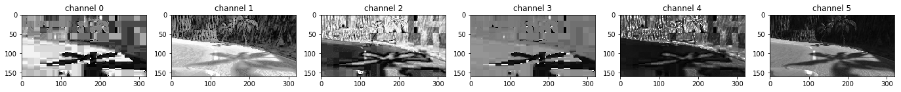

# Behaviorial Cloning Project

Overview
---

## Simulator & Training Data

following Laps were recorded:

	*Offroad
	*Centered Drive Foreward
	*Right Side Drive Foreward (with additional Steering offset)
	*Left Side Drive Foreward (with additional Steering offset)
	*Centerd Backward Drive
	*Centerd Backward Drive with digital steering
	*Drive in, out and throu Shadows
	*Track exit corrections

a training data example is saved as
left_2017_04_29_16_46_10_924.jpg

The steering argumentation values for

| Situation                  |:Steering Argumentation:| 
| -------------------------- |:----------------------:| 
| left cam centerd drives    | +0.3                   |
| centerd cam centerd drives | 0                      |
| left cam centerd drives    | -0.3                   |
| left cam left drives       | -1.8                   |
| centerd cam left drives    | -1.2                   |
| left cam left drives       | -.7                    |
| left cam right drives      | -1.8                   |
| centerd cam right drives   | -1.2                   |
| left cam right drives      | -.7                    | 

A perspective transform with according steering adaption would be a futher approach for data argumentation.

## Model & Training

The Pi Controller was extended to adapot the target speed with the steering for a kind of more natural feeling during drive and more Frames per distance in more difficult situations.

I experimented with RGB / HSL / HSV and Histogramm enhancemend and end up using HSL HSV and Histogramm enhancemend together as input. The Goal there was to give the model richer information in shadowed parts of the road. 

Using grayscale would make the model smaller but the squashed information will also make it even more difficult to distinguish shadows on the raad from real objects (see also graphic below).

The following Model was designed:

Layer (type)                    |Output Shape         | Param #    | Connected to                     
---                    |---        | ---    | ---                     
cropping2d_1 (Cropping2D)       |(None, 104, 320, 6)  | 0          | cropping2d_input_1[0][0]         
lambda_1 (Lambda)               |(None, 104, 320, 6)  | 0          | cropping2d_1[0][0]               
convolution2d_1 (Convolution2D) |(None, 52, 160, 16)  | 7792       | lambda_1[0][0]                   
convolution2d_2 (Convolution2D) |(None, 26, 80, 32)   | 25120      | convolution2d_1[0][0]            
convolution2d_3 (Convolution2D) |(None, 26, 80, 64)   | 51264      | convolution2d_2[0][0]            
maxpooling2d_1 (MaxPooling2D)   |(None, 13, 40, 64)   | 0          | convolution2d_3[0][0]            
convolution2d_4 (Convolution2D) |(None, 7, 20, 128)   | 73856      | maxpooling2d_1[0][0]             
convolution2d_5 (Convolution2D) |(None, 4, 10, 256)   | 295168     | convolution2d_4[0][0]            
convolution2d_6 (Convolution2D) |(None, 4, 10, 512)   | 1180160    | convolution2d_5[0][0]            
maxpooling2d_2 (MaxPooling2D)   |(None, 2, 5, 512)    | 0          | convolution2d_6[0][0]            
batchnormalization_1 (BatchNorma|(None, 2, 5, 512)    | 2048       | maxpooling2d_2[0][0]             
flatten_1 (Flatten)             |(None, 5120)         | 0          | batchnormalization_1[0][0]       
dropout_1 (Dropout)             |(None, 5120)         | 0          | flatten_1[0][0]                  
dense_1 (Dense)                 |(None, 256)          | 1310976    | dropout_1[0][0]                  
dense_2 (Dense)                 |(None, 27)           | 6939       | dense_1[0][0]                    
dense_3 (Dense)                 |(None, 4)            | 112        | dense_2[0][0]                    
dense_4 (Dense)                 |(None, 1)            | 5          | dense_3[0][0]    

____________________________________________________________________________________________________
Total params: 2,953,440
Trainable params: 2,952,416
Non-trainable params: 1,024

The used activation functions are elu and linear. Experiments with a sigmoid layer before the linear layers at the end showed that this will improve the convergence speed (at least at the beginning) a lot.

The Model was saved periodicaly to handle training interruptions.

## Video 

Beause of very low GPU und CPU specs on my moblie device the model was deployed on lowest screen resolution and graphics quality with a 1/20x speed hack to make the Frames per Second reasonble dense.

The Videos are generated and saved as:

